# 🔧 DOKUMENTASI ALUR APLIKASI TEKNIS HOME WORKERS

## 🏗️ ARSITEKTUR SISTEM

### 📱 Frontend Architecture (Flutter)
```
lib/
├── core/                    # Core functionality
│   ├── api/                # API service layer
│   ├── models/             # Data models
│   ├── state/              # State management (Provider)
│   └── utils/              # Utilities & helpers
├── features/               # Feature-based modules
│   ├── auth/               # Authentication
│   ├── costumer_flow/      # Customer features
│   ├── worker_flow/        # Worker features
│   ├── profile/            # Profile management
│   ├── chat/               # Chat system
│   └── notifications/      # Notification system
└── shared_widgets/         # Reusable UI components
```

### 🖥️ Backend Architecture (Node.js + Firebase)
```
functions/src/
├── controllers/            # Business logic controllers
├── routes/                # API route definitions
├── middlewares/           # Authentication & validation
├── utils/                 # Helper functions
└── config/                # Configuration files
```

---

## 🔐 AUTHENTICATION FLOW

### 1. Registration Process

#### Customer Registration
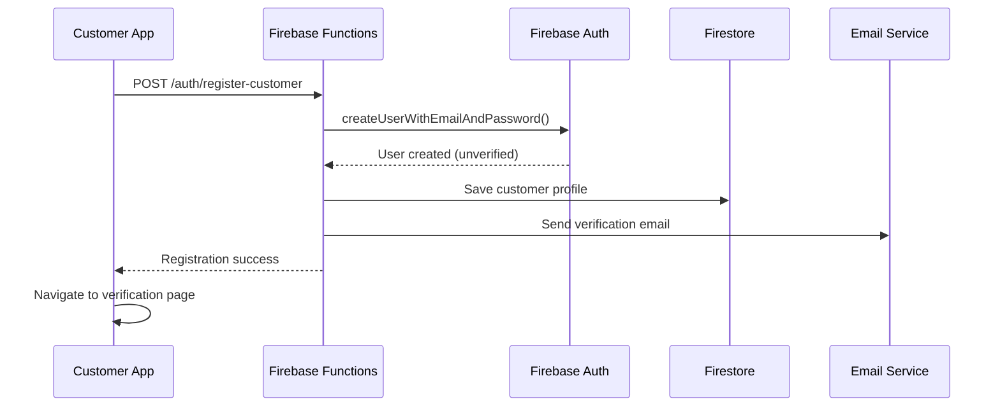
```mermaid
sequenceDiagram
    participant C as Customer App
    participant API as Firebase Functions
    participant Auth as Firebase Auth
    participant DB as Firestore
    participant Email as Email Service

    C->>API: POST /auth/register-customer
    API->>Auth: createUserWithEmailAndPassword()
    Auth-->>API: User created (unverified)
    API->>DB: Save customer profile
    API->>Email: Send verification email
    API-->>C: Registration success
    C->>C: Navigate to verification page
```

#### Worker Registration
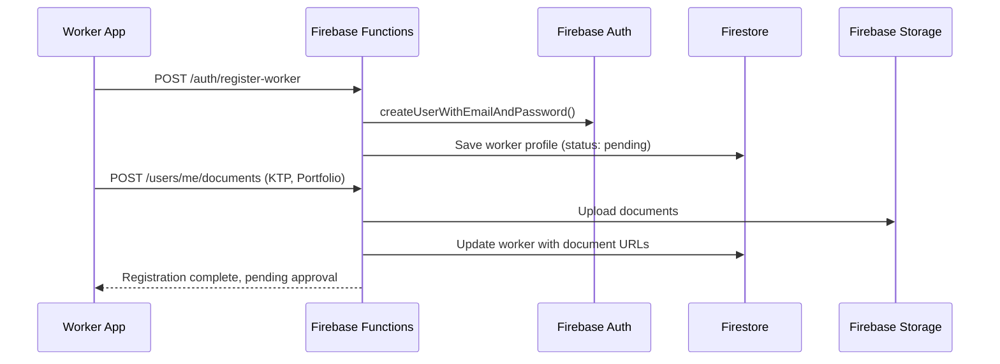
```mermaid
sequenceDiagram
    participant W as Worker App
    participant API as Firebase Functions
    participant Auth as Firebase Auth
    participant DB as Firestore
    participant Storage as Firebase Storage

    W->>API: POST /auth/register-worker
    API->>Auth: createUserWithEmailAndPassword()
    API->>DB: Save worker profile (status: pending)
    W->>API: POST /users/me/documents (KTP, Portfolio)
    API->>Storage: Upload documents
    API->>DB: Update worker with document URLs
    API-->>W: Registration complete, pending approval
```

### 2. Login Process
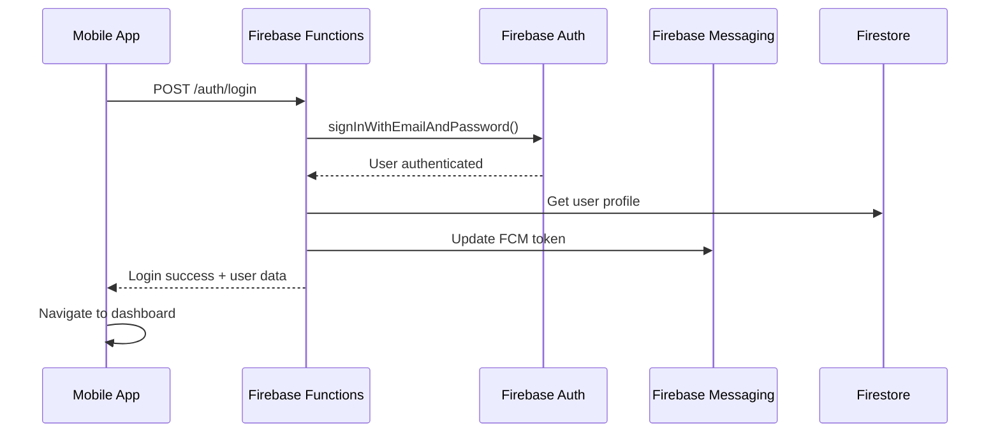
```mermaid
sequenceDiagram
    participant App as Mobile App
    participant API as Firebase Functions
    participant Auth as Firebase Auth
    participant FCM as Firebase Messaging
    participant DB as Firestore

    App->>API: POST /auth/login
    API->>Auth: signInWithEmailAndPassword()
    Auth-->>API: User authenticated
    API->>DB: Get user profile
    API->>FCM: Update FCM token
    API-->>App: Login success + user data
    App->>App: Navigate to dashboard
```

---

## 🛍️ MARKETPLACE & BOOKING FLOW

### 1. Service Discovery
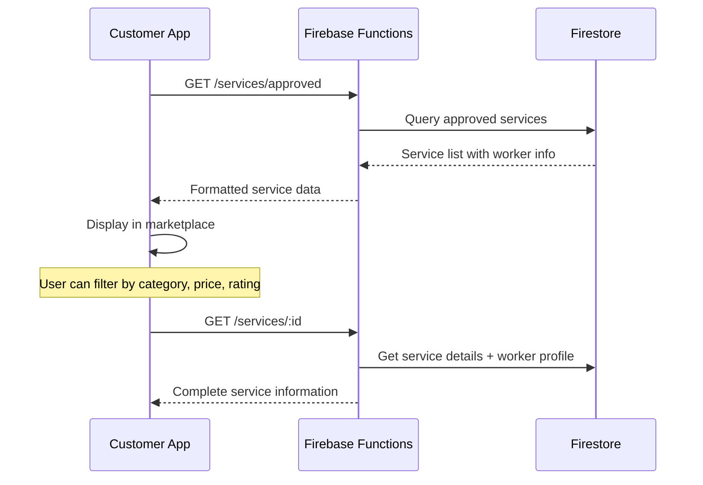
```mermaid
sequenceDiagram
    participant C as Customer App
    participant API as Firebase Functions
    participant DB as Firestore

    C->>API: GET /services/approved
    API->>DB: Query approved services
    DB-->>API: Service list with worker info
    API-->>C: Formatted service data
    C->>C: Display in marketplace
    
    Note over C: User can filter by category, price, rating
    
    C->>API: GET /services/:id
    API->>DB: Get service details + worker profile
    API-->>C: Complete service information
```

### 2. Booking Process
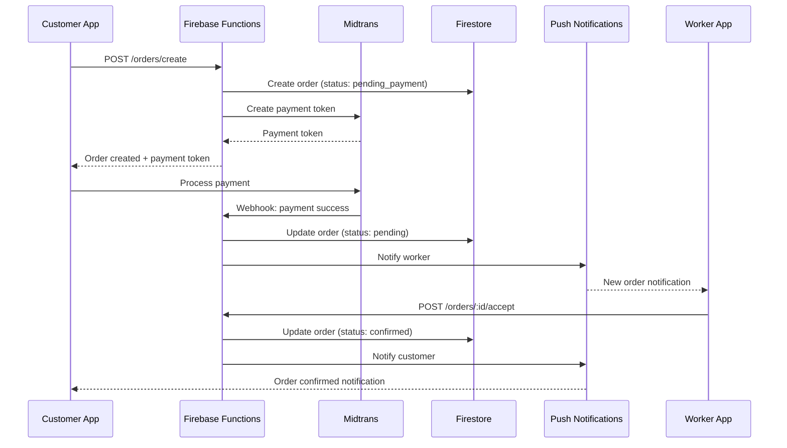
```mermaid
sequenceDiagram
    participant C as Customer App
    participant API as Firebase Functions
    participant Payment as Midtrans
    participant DB as Firestore
    participant FCM as Push Notifications
    participant W as Worker App

    C->>API: POST /orders/create
    API->>DB: Create order (status: pending_payment)
    API->>Payment: Create payment token
    Payment-->>API: Payment token
    API-->>C: Order created + payment token
    
    C->>Payment: Process payment
    Payment->>API: Webhook: payment success
    API->>DB: Update order (status: pending)
    API->>FCM: Notify worker
    FCM-->>W: New order notification
    
    W->>API: POST /orders/:id/accept
    API->>DB: Update order (status: confirmed)
    API->>FCM: Notify customer
    FCM-->>C: Order confirmed notification
```

---

## 📋 ORDER MANAGEMENT FLOW

### 1. Order Lifecycle Management
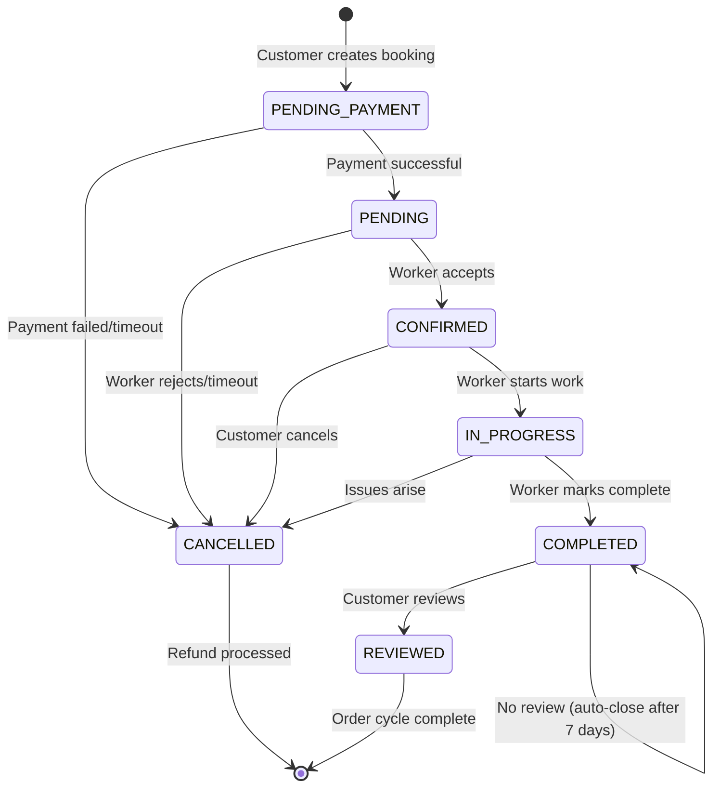
```mermaid
stateDiagram-v2
    [*] --> PENDING_PAYMENT: Customer creates booking
    PENDING_PAYMENT --> PENDING: Payment successful
    PENDING_PAYMENT --> CANCELLED: Payment failed/timeout
    
    PENDING --> CONFIRMED: Worker accepts
    PENDING --> CANCELLED: Worker rejects/timeout
    
    CONFIRMED --> IN_PROGRESS: Worker starts work
    CONFIRMED --> CANCELLED: Customer cancels
    
    IN_PROGRESS --> COMPLETED: Worker marks complete
    IN_PROGRESS --> CANCELLED: Issues arise
    
    COMPLETED --> REVIEWED: Customer reviews
    COMPLETED --> COMPLETED: No review (auto-close after 7 days)
    
    CANCELLED --> [*]: Refund processed
    REVIEWED --> [*]: Order cycle complete
```

### 2. Real-time Order Updates
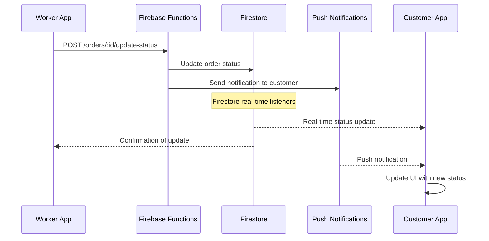
```mermaid
sequenceDiagram
    participant W as Worker App
    participant API as Firebase Functions
    participant DB as Firestore
    participant FCM as Push Notifications
    participant C as Customer App

    W->>API: POST /orders/:id/update-status
    API->>DB: Update order status
    API->>FCM: Send notification to customer
    
    Note over DB: Firestore real-time listeners
    DB-->>C: Real-time status update
    DB-->>W: Confirmation of update
    
    FCM-->>C: Push notification
    C->>C: Update UI with new status
```

---

## 💬 CHAT SYSTEM FLOW

### 1. Chat Initialization
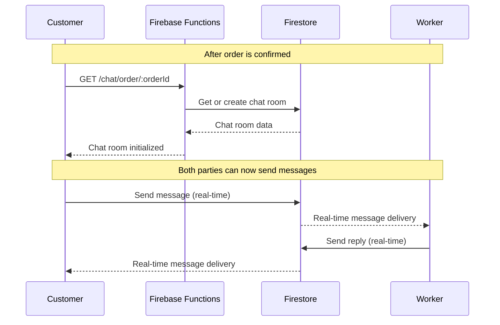
```mermaid
sequenceDiagram
    participant C as Customer
    participant API as Firebase Functions
    participant DB as Firestore
    participant W as Worker

    Note over C,W: After order is confirmed
    
    C->>API: GET /chat/order/:orderId
    API->>DB: Get or create chat room
    DB-->>API: Chat room data
    API-->>C: Chat room initialized
    
    Note over C,W: Both parties can now send messages
    
    C->>DB: Send message (real-time)
    DB-->>W: Real-time message delivery
    W->>DB: Send reply (real-time)
    DB-->>C: Real-time message delivery
```

### 2. File Sharing in Chat
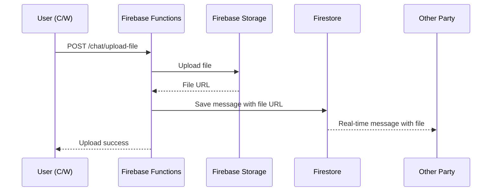
```mermaid
sequenceDiagram
    participant User as User (C/W)
    participant API as Firebase Functions
    participant Storage as Firebase Storage
    participant DB as Firestore
    participant Other as Other Party

    User->>API: POST /chat/upload-file
    API->>Storage: Upload file
    Storage-->>API: File URL
    API->>DB: Save message with file URL
    DB-->>Other: Real-time message with file
    API-->>User: Upload success
```

---

## 💰 PAYMENT & WALLET FLOW

### 1. Payment Processing
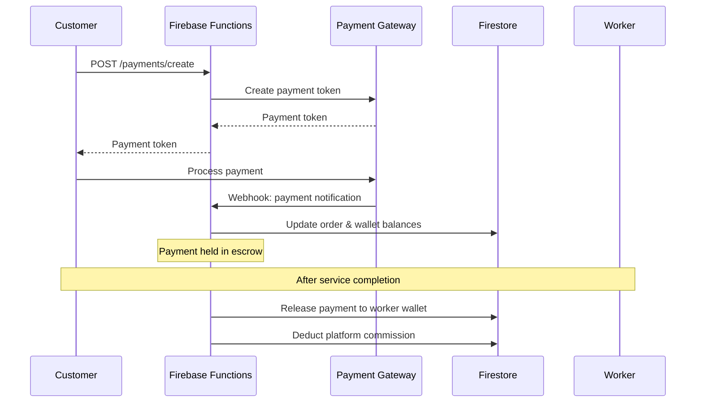
```mermaid
sequenceDiagram
    participant C as Customer
    participant API as Firebase Functions
    participant Midtrans as Payment Gateway
    participant DB as Firestore
    participant W as Worker

    C->>API: POST /payments/create
    API->>Midtrans: Create payment token
    Midtrans-->>API: Payment token
    API-->>C: Payment token
    
    C->>Midtrans: Process payment
    Midtrans->>API: Webhook: payment notification
    API->>DB: Update order & wallet balances
    
    Note over API: Payment held in escrow
    
    Note over C,W: After service completion
    API->>DB: Release payment to worker wallet
    API->>DB: Deduct platform commission
```

### 2. Wallet Management
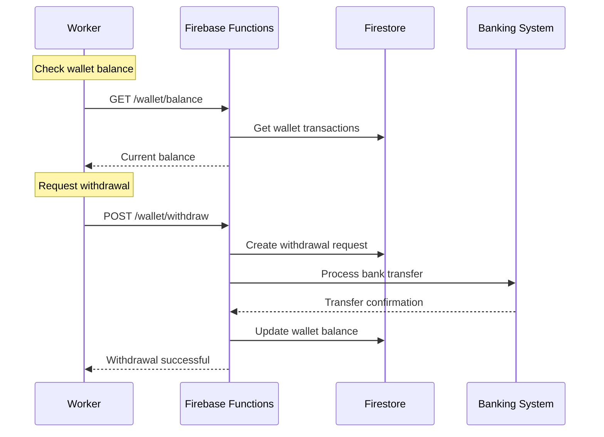
```mermaid
sequenceDiagram
    participant W as Worker
    participant API as Firebase Functions
    participant DB as Firestore
    participant Bank as Banking System

    Note over W: Check wallet balance
    W->>API: GET /wallet/balance
    API->>DB: Get wallet transactions
    API-->>W: Current balance
    
    Note over W: Request withdrawal
    W->>API: POST /wallet/withdraw
    API->>DB: Create withdrawal request
    API->>Bank: Process bank transfer
    Bank-->>API: Transfer confirmation
    API->>DB: Update wallet balance
    API-->>W: Withdrawal successful
```

---

## 🔔 NOTIFICATION SYSTEM FLOW

### 1. Push Notification Flow
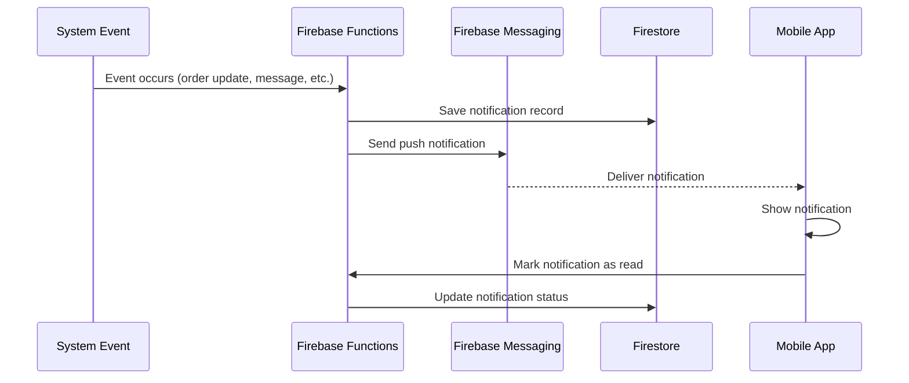
```mermaid
sequenceDiagram
    participant Trigger as System Event
    participant API as Firebase Functions
    participant FCM as Firebase Messaging
    participant DB as Firestore
    participant App as Mobile App

    Trigger->>API: Event occurs (order update, message, etc.)
    API->>DB: Save notification record
    API->>FCM: Send push notification
    FCM-->>App: Deliver notification
    
    App->>App: Show notification
    App->>API: Mark notification as read
    API->>DB: Update notification status
```

### 2. In-App Notification Management
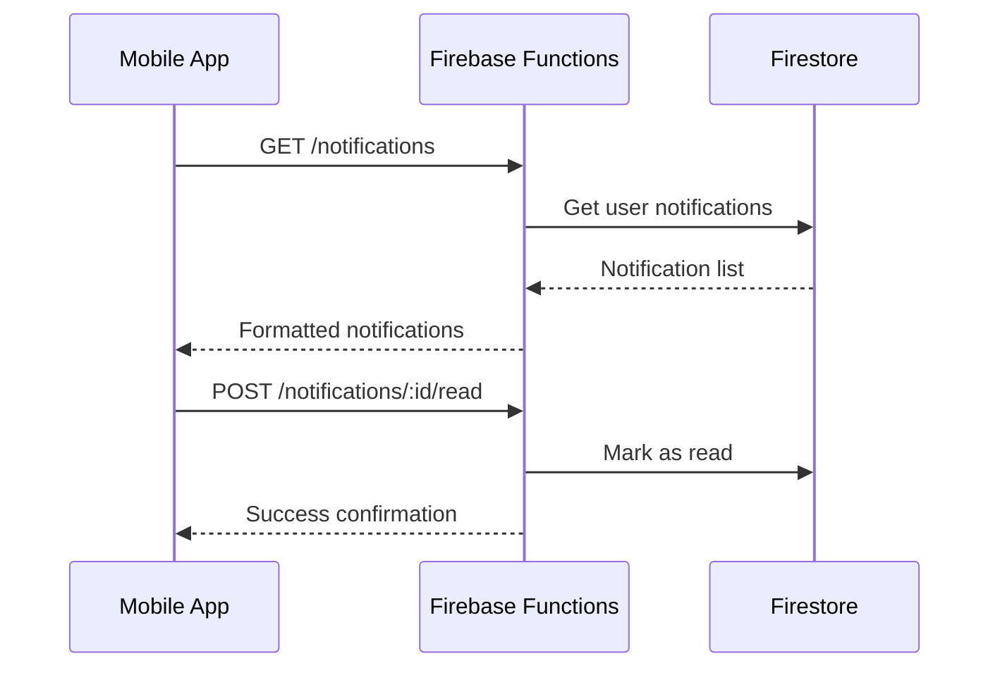
```mermaid
sequenceDiagram
    participant App as Mobile App
    participant API as Firebase Functions
    participant DB as Firestore

    App->>API: GET /notifications
    API->>DB: Get user notifications
    DB-->>API: Notification list
    API-->>App: Formatted notifications
    
    App->>API: POST /notifications/:id/read
    API->>DB: Mark as read
    API-->>App: Success confirmation
```

---

## 📊 ADMIN DASHBOARD FLOW

### 1. Worker Approval Process
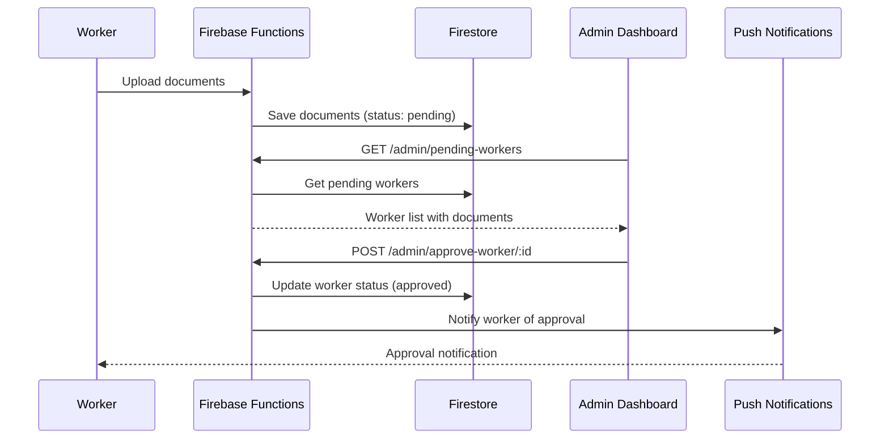
```mermaid
sequenceDiagram
    participant W as Worker
    participant API as Firebase Functions
    participant DB as Firestore
    participant Admin as Admin Dashboard
    participant FCM as Push Notifications

    W->>API: Upload documents
    API->>DB: Save documents (status: pending)
    
    Admin->>API: GET /admin/pending-workers
    API->>DB: Get pending workers
    API-->>Admin: Worker list with documents
    
    Admin->>API: POST /admin/approve-worker/:id
    API->>DB: Update worker status (approved)
    API->>FCM: Notify worker of approval
    FCM-->>W: Approval notification
```

### 2. Service Moderation
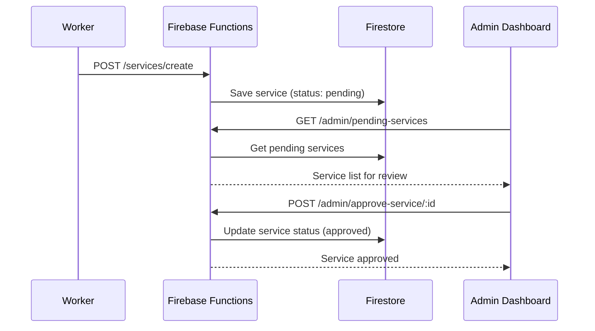
```mermaid
sequenceDiagram
    participant W as Worker
    participant API as Firebase Functions
    participant DB as Firestore
    participant Admin as Admin Dashboard

    W->>API: POST /services/create
    API->>DB: Save service (status: pending)
    
    Admin->>API: GET /admin/pending-services
    API->>DB: Get pending services
    API-->>Admin: Service list for review
    
    Admin->>API: POST /admin/approve-service/:id
    API->>DB: Update service status (approved)
    API-->>Admin: Service approved
```

---

## 🔍 SEARCH & FILTERING FLOW

### 1. Advanced Search Implementation
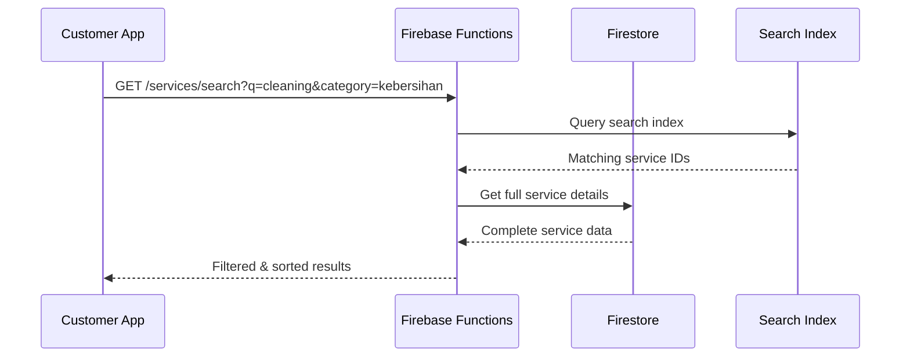
```mermaid
sequenceDiagram
    participant C as Customer App
    participant API as Firebase Functions
    participant DB as Firestore
    participant Search as Search Index

    C->>API: GET /services/search?q=cleaning&category=kebersihan
    API->>Search: Query search index
    Search-->>API: Matching service IDs
    API->>DB: Get full service details
    DB-->>API: Complete service data
    API-->>C: Filtered & sorted results
```

### 2. Location-based Services
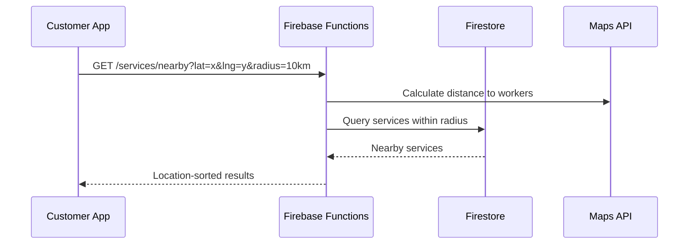
```mermaid
sequenceDiagram
    participant C as Customer App
    participant API as Firebase Functions
    participant DB as Firestore
    participant Maps as Maps API

    C->>API: GET /services/nearby?lat=x&lng=y&radius=10km
    API->>Maps: Calculate distance to workers
    API->>DB: Query services within radius
    DB-->>API: Nearby services
    API-->>C: Location-sorted results
```

---

## 📈 ANALYTICS & REPORTING FLOW

### 1. User Behavior Tracking
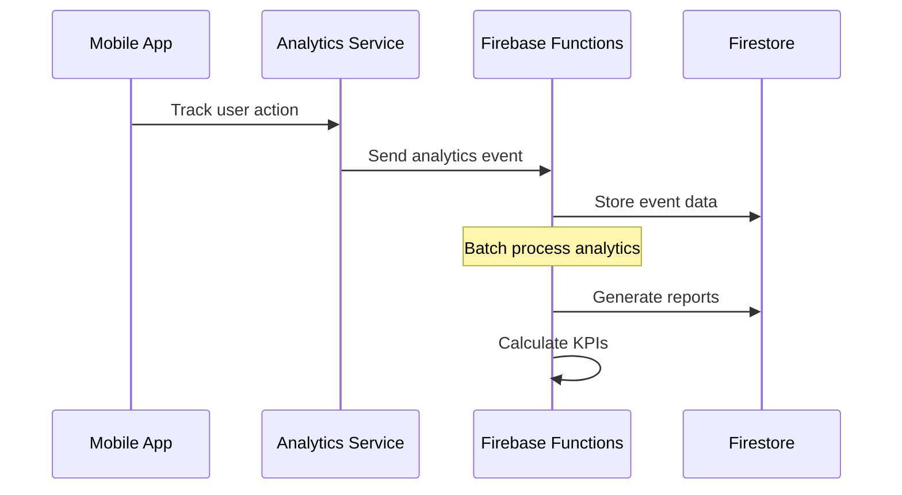
```mermaid
sequenceDiagram
    participant App as Mobile App
    participant Analytics as Analytics Service
    participant API as Firebase Functions
    participant DB as Firestore

    App->>Analytics: Track user action
    Analytics->>API: Send analytics event
    API->>DB: Store event data
    
    Note over API: Batch process analytics
    API->>DB: Generate reports
    API->>API: Calculate KPIs
```

### 2. Business Intelligence Dashboard
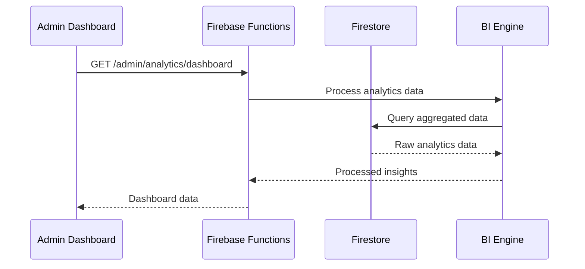
```mermaid
sequenceDiagram
    participant Admin as Admin Dashboard
    participant API as Firebase Functions
    participant DB as Firestore
    participant BI as BI Engine

    Admin->>API: GET /admin/analytics/dashboard
    API->>BI: Process analytics data
    BI->>DB: Query aggregated data
    DB-->>BI: Raw analytics data
    BI-->>API: Processed insights
    API-->>Admin: Dashboard data
```

---

## 🛡️ SECURITY & ERROR HANDLING

### 1. Authentication Middleware Flow
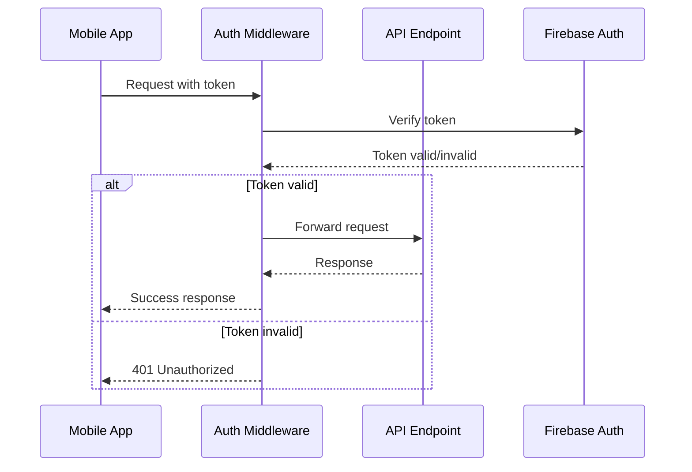
```mermaid
sequenceDiagram
    participant App as Mobile App
    participant Middleware as Auth Middleware
    participant API as API Endpoint
    participant Auth as Firebase Auth

    App->>Middleware: Request with token
    Middleware->>Auth: Verify token
    Auth-->>Middleware: Token valid/invalid
    
    alt Token valid
        Middleware->>API: Forward request
        API-->>Middleware: Response
        Middleware-->>App: Success response
    else Token invalid
        Middleware-->>App: 401 Unauthorized
    end
```

### 2. Error Handling Flow
```mermaid
sequenceDiagram
    participant App as Mobile App
    participant API as Firebase Functions
    participant ErrorHandler as Error Handler
    participant Logger as Logging Service

    App->>API: API Request
    API->>API: Process request
    
    alt Success
        API-->>App: Success response
    else Error occurs
        API->>ErrorHandler: Handle error
        ErrorHandler->>Logger: Log error details
        ErrorHandler-->>App: User-friendly error message
    end
    
    App->>App: Display error with retry option
```

---

## 🔄 DATA SYNCHRONIZATION FLOW

### 1. Offline-Online Sync
```mermaid
sequenceDiagram
    participant App as Mobile App
    participant LocalDB as Local Storage
    participant API as Firebase Functions
    participant DB as Firestore

    Note over App: App goes offline
    App->>LocalDB: Store actions locally
    
    Note over App: App comes online
    App->>API: Sync pending actions
    API->>DB: Process queued actions
    DB-->>API: Updated data
    API-->>App: Sync complete
    App->>LocalDB: Clear pending actions
```

### 2. Real-time Data Updates
```mermaid
sequenceDiagram
    participant App1 as User App 1
    participant DB as Firestore
    participant App2 as User App 2

    App1->>DB: Update data
    DB-->>App2: Real-time update (listener)
    App2->>App2: Update UI automatically
    
    Note over DB: Firestore real-time listeners
    Note over App2: No manual refresh needed
```

---

## 🚀 DEPLOYMENT & SCALING FLOW

### 1. CI/CD Pipeline
```mermaid
sequenceDiagram
    participant Dev as Developer
    participant Git as Git Repository
    participant CI as CI/CD Pipeline
    participant Firebase as Firebase Hosting
    participant PlayStore as App Stores

    Dev->>Git: Push code changes
    Git->>CI: Trigger build
    CI->>CI: Run tests
    CI->>CI: Build applications
    CI->>Firebase: Deploy backend functions
    CI->>PlayStore: Deploy mobile apps
    CI-->>Dev: Deployment status
```

### 2. Auto-scaling Configuration
```mermaid
sequenceDiagram
    participant Load as Load Balancer
    participant Functions as Firebase Functions
    participant DB as Firestore
    participant Monitor as Monitoring

    Load->>Functions: High traffic
    Functions->>Functions: Auto-scale instances
    Monitor->>Monitor: Track performance metrics
    
    alt High load detected
        Monitor->>Functions: Scale up
    else Low load detected
        Monitor->>Functions: Scale down
    end
```

---

*Dokumentasi teknis ini memberikan panduan detail untuk pengembangan, maintenance, dan scaling aplikasi Home Workers.*
